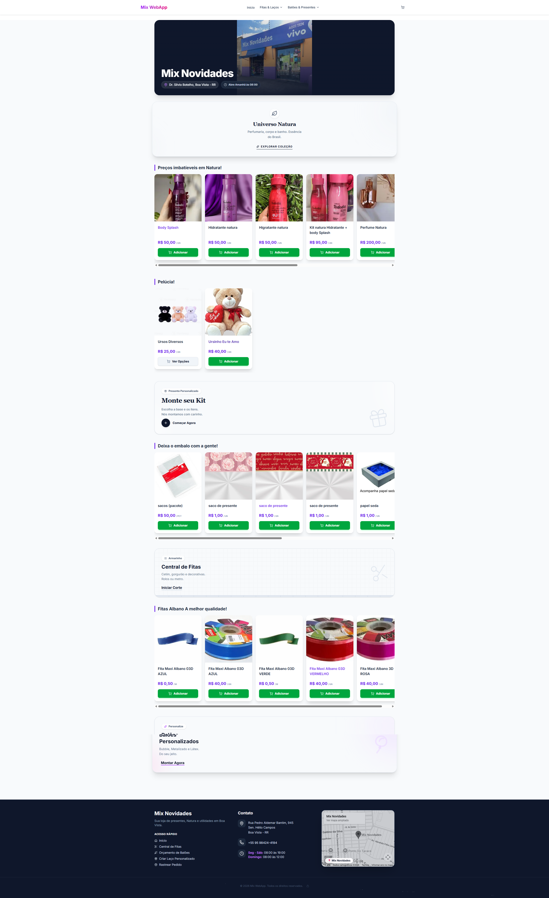

<h1 align="center">Mix Webapp: Ecossistema de E-commerce & Customização</h1>

<div align="center">
  
</div>

<p align="center">
  
  
  
  
</p>

## 📌 Visão Geral

O **Mix Webapp** é uma plataforma de e-commerce Full Stack de alta performance, desenvolvida para transformar a experiência de compra de artigos para presentes e decoração. Diferente de lojas convencionais, o projeto foca na **venda consultiva e personalizada**, permitindo que o cliente finalize pedidos via WhatsApp após configurar produtos complexos através de interfaces interativas.

## 🛠️ Setores do Sistema e Decisões Técnicas

### 1. Engine de Customização (The Builders)
O maior desafio técnico foi a criação de fluxos de montagem de produtos (`KitBuilder`, `LacoBuilder`).
* **Decisão:** Utilizei **Zustand** para o gerenciamento de estado global desses builders, permitindo que a precificação e a lista de componentes sejam atualizadas em tempo real sem re-renders desnecessários.
* **Impacto:** Redução na taxa de abandono de carrinho, pois o usuário visualiza o "presente" antes mesmo de falar com o vendedor.

### 2. Painel Administrativo (Backoffice)
Uma área restrita para gestão total da operação:
* **Gestão de Pedidos:** Listagem e status de pedidos recebidos.
* **Inventário Dinâmico:** Gerenciamento de produtos, incluindo uma seção dedicada para itens Natura.
* **Configurações de Loja:** Controle de status (Aberta/Fechada) e banners promocionais via Firebase Firestore.

### 3. SEO & Visibilidade
Arquitetura focada em conversão orgânica:
* **JSON-LD:** Implementação de dados estruturados para que o Google entenda a organização e os produtos.
* **PWA:** Configurado para ser instalável, simulando a experiência de um app nativo para clientes recorrentes.

## 🚀 Stack Tecnológica

| Tecnologia | Finalidade |
| :--- | :--- |
| **Next.js 15** | Framework com App Router para SSR e Streaming de dados. |
| **TypeScript** | Tipagem estática para garantir a segurança em contratos de pedidos. |
| **Tailwind CSS** | Estilização utilitária e responsividade mobile-first. |
| **Shadcn/UI** | Sistema de componentes acessíveis e consistentes. |
| **Firebase** | Autenticação, Banco de Dados (Firestore) e Storage de imagens. |
| **Vitest** | Testes unitários para lógica de carrinho e calculadoras de preços. |

## ⚙️ Como executar o projeto

1. **Requisitos:** Node.js 18+ e uma conta no Firebase.
2. **Clone o repositório:**
   ```bash
   git clone [https://github.com/WelderBM/mix-webapp](https://github.com/WelderBM/mix-webapp)
   ```
3. **Instale as dependências:**
   ```bash
   npm install
   ```
4. **Variáveis de Ambiente:**
   Crie um arquivo `.env.local` na raiz com suas credenciais do Firebase (veja `FIREBASE_SETUP.md` para referência).
5. **Inicie o servidor de desenvolvimento:**
   ```bash
   npm run dev
   ```

## 📈 Evolução e Roadmap
- [ ] Implementação de Pagamento Direto (Stripe/Pix).
- [ ] Dashboards de análise de vendas com gráficos.
- [ ] Notificações Push para status de pedidos.

---
**Autor:** [Welder Barroso](https://linkedin.com/in/welder-barroso-37b654207)
*Desenvolvido com foco em escalabilidade e experiência do usuário final.*
