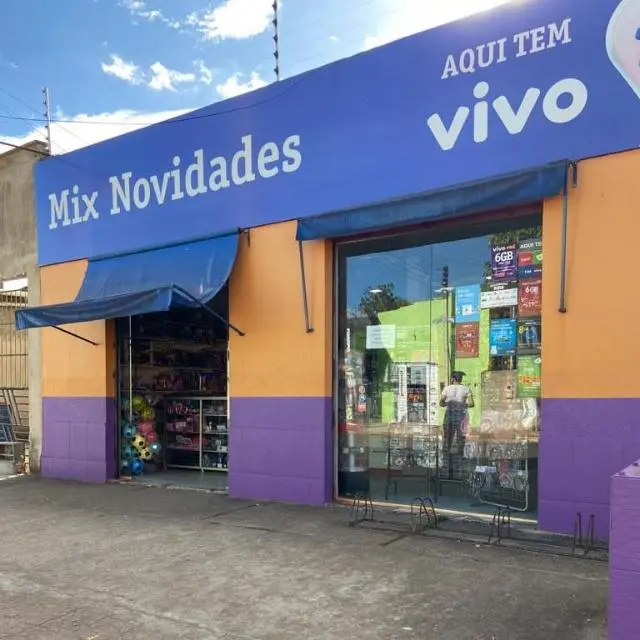

<h1 align="center">Mix-webapp</h1>

<div align="center">
  
</div>

<h2 align="center"><a href="#">View site</a></h2>

## Index

- <a href="#funcionalidades-do-projeto">Project features</a>
- <a href="#como-rodar">How to run this project</a>
- <a href="#tecnologias-ultilizadas">Technologies used</a>
- <a href="#pessoas-autoras">Authors</a>

<h2 id="funcionalidades-do-projeto">Features</h2>

- ✅ **Custom Product Builder:** Interactive tool to build gift baskets and ribbons. 🎀
- ✅ **Inventory Management:** Real-time stock tracking and admin dashboard. 📦
- ✅ **Cart Logic:** Complex pricing calculations for custom kits. 🛒
- ✅ **Modern PWA:** Installable web application with offline capabilities. 📲
- ✅ **High SEO Performance:** Optimized metadata and sitemap for better ranking. 📈

<br>

<h2 id="como-rodar">How to run the project</h2>

```bash
    # Clone this repository
    $ git clone [https://github.com/WelderBM/mix-webapp](https://github.com/WelderBM/mix-webapp)

    # Access the project folder
    $ cd mix-webapp

    # Install the dependencies
    $ npm install

    # Run the application
    $ npm run dev
```

<h2 id="tecnologias-ultilizadas">Technologies used</h2> 

1. [Next.js 15](https://nextjs.org/)
2. [TypeScript](https://www.typescriptlang.org/)
3. [Shadcn/UI](https://ui.shadcn.com/)
4. [Firebase](https://firebase.google.com/)
5. [Zustand](https://zustand-demo.pmnd.rs/)

<h2 id="pessoas-autoras">Authors</h2> 

**Welder Barroso**
