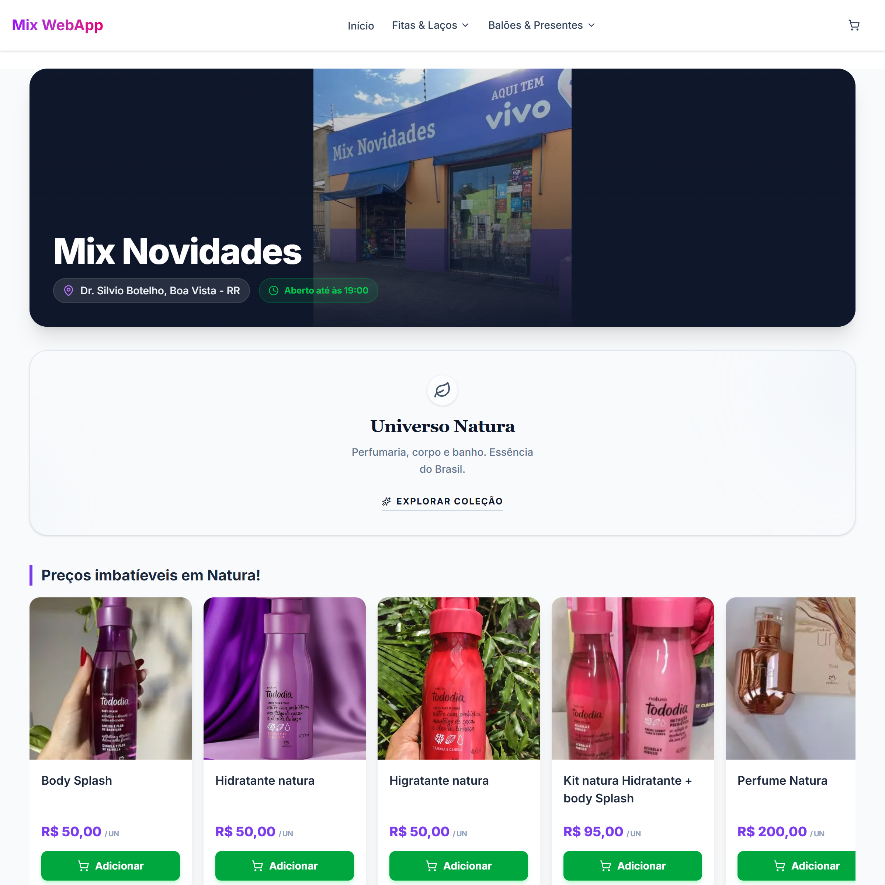

[PT-BR] · [EN](#english-version)

<div align="center">

# Mix Webapp

> Plataforma de e-commerce Full Stack com engine de customização de produtos, painel administrativo e integração Firebase — desenvolvida para um negócio real de presentes e decoração.




<br/>

</div>

---

## 📋 Índice

- [Sobre o Projeto](#sobre-o-projeto)
- [Arquitetura do Sistema](#arquitetura-do-sistema)
- [Tecnologias](#tecnologias)
- [Status](#status)
- [Aprendizados](#aprendizados)
- [Contato](#contato)

---

## Sobre o Projeto

O **Mix Webapp** é uma plataforma de e-commerce Full Stack de alta performance, desenvolvida para transformar a experiência de compra de artigos para presentes e decoração. Diferente de lojas convencionais, o projeto foca na **venda consultiva e personalizada**: o cliente configura produtos complexos através de interfaces interativas e finaliza o pedido diretamente via WhatsApp com o vendedor.
O projeto nasceu de uma necessidade real de negócio — a loja precisava de uma solução digital que respeitasse seu modelo de venda consultiva, ao invés de forçar o cliente a um checkout genérico.

> Do `KitBuilder` ao painel admin, cada feature foi construída para resolver um problema real do negócio.

### Funcionalidades

- [x] **Engine de Customização** — `KitBuilder` e `LacoBuilder` para montagem interativa de produtos
- [x] **Painel Administrativo** — gestão de pedidos, inventário e configurações da loja
- [x] **Controle de Loja** — status (Aberta/Fechada) e banners promocionais via Firestore
- [x] **Inventário Dinâmico** — gerenciamento de produtos, incluindo seção Natura
- [x] **SEO com JSON-LD** — dados estruturados para indexação pelo Google
- [x] **PWA Ready** — instalável como app nativo em dispositivos móveis
- [x] Integração Firebase completa (Auth, Firestore, Storage)
- [ ] Pagamento direto (Stripe / Pix)
- [ ] Dashboard de analytics de vendas
- [ ] Notificações Push para status de pedidos

---

## Arquitetura do Sistema

### 1. Engine de Customização (The Builders)

O maior desafio técnico: criar fluxos de montagem de produtos como `KitBuilder` e `LacoBuilder`.

**Decisão:** **Zustand** para gerenciamento de estado global dos builders, permitindo atualização de preços e lista de componentes em tempo real sem re-renders desnecessários.

**Impacto:** Redução na taxa de abandono de carrinho — o cliente visualiza o produto montado antes de confirmar o pedido.

### 2. Painel Administrativo (Backoffice)

Área restrita para gestão total da operação:

- Listagem e atualização de status de pedidos recebidos
- Gerenciamento de inventário com seção dedicada para itens Natura
- Controle de status da loja e banners via Firebase Firestore

### 3. SEO & Visibilidade

- **JSON-LD** para dados estruturados — o Google entende a organização e os produtos
- **PWA** configurado para instalação como app nativo, criando recorrência de acessos

---

## Tecnologias

| Tecnologia                                                                                         | Finalidade                                    |
| :------------------------------------------------------------------------------------------------- | :-------------------------------------------- |
|        | Framework com App Router para SSR e Streaming |
|    | Tipagem estática para contratos de pedido     |
|          | Auth, Firestore e Storage de imagens          |
|                          | Estado global dos builders                    |
|   | Estilização mobile-first                      |
|                       | Componentes acessíveis e consistentes         |
|                  | Testes unitários de lógica de negócio         |
|  | Animações de interface                        |

---

## Status

```
🟡 Em desenvolvimento
```

**Versão atual:** 0.1.0

### Roadmap

- [ ] Implementação de Pagamento Direto (Stripe / Pix)
- [ ] Dashboard de análise de vendas com gráficos
- [ ] Notificações Push para atualização de status de pedidos

---

## Aprendizados

### Contexto

> Projeto freelance Full Stack de alta complexidade para um negócio real de presentes e decoração, com modelo de venda consultiva via WhatsApp.

### O que aprendi

- Arquitetura **Next.js 15+ App Router** com Server Components, Streaming e React Server Actions
- Gerenciamento de estado complexo com **Zustand**: builders com precificação reativa em tempo real
- Design de sistema de componentes com **shadcn/ui** sobre Radix primitivos
- Testes unitários com **Vitest** para lógica crítica de negócio (calculadoras de preço, regras de carrinho)
- SEO técnico avançado: **JSON-LD**, metadata dinâmica, Open Graph via Next.js
- Gestão de projeto Full Stack: da modelagem de dados no Firestore à entrega de UI

### O que faria diferente

- Implementaria **Server Actions** para mutações desde o início, reduzindo o tamanho do bundle client-side
- Adotaria **React Query (TanStack Query)** em vez de `useEffect` para fetching de dados
- Estruturaria as **Firestore Security Rules** com mais granularidade desde o dia zero

---

## Contato

<div align="center">

Desenvolvido por **Welder Barroso de Melo**

[](https://welderbarroso.dev)

[](https://linkedin.com/in/welder-barroso-37b654207)
[](https://github.com/WelderBM)
[](https://wa.me/5595984006377)
[](mailto:welderbarroso.dev@gmail.com)

</div>

---

<div align="center">
<sub>Feito com foco e café · <a href="https://welderbarroso.dev">welderbarroso.dev</a></sub>
</div>
